# Settings → Ollama inference UX redesign — scoping

**Status:** SCOPING ONLY — no implementation. Aaron reviews + answers the
open questions before any code lands.
**Date:** 2026-06-04
**Branch:** `scope/settings-ollama-defaults-ux`
**Builds on:** `d02aaa3` (gpui Settings: surface stored Ollama defaults via
Gateway read)

---

## 1. Motivation

`d02aaa3` wired the Settings → "Ollama inference" block to read persisted
values, but on Aaron's fresh install all 9 fields render as `—`. The dash is
the panel's *loading default* (`OllamaSettings::default()` = every field
`None`). The intent was "no user override → dash," but that conflates two
very different states and shows the user nothing actionable.

Aaron's chosen direction (**option B**): query Ollama for the
currently-selected model's own defaults and show those as **placeholder**
values. Typing into a field overrides the placeholder. When **no model is
selected**, replace the whole field grid with a "No Model Currently
Selected" empty state.

The goal: a user opening Settings sees the parameter values that *would
actually apply* to their next chat turn — model defaults where they haven't
overridden, their override where they have — instead of a column of dashes.

---

## 2. What the audit found (current state)

### 2.1 The 9 fields and their persistence

Defined in `Core/GUI/Frontend/Panels/Settings/src/ipc.rs`
(`OllamaSettings`) and rendered by `sections.rs::ollama_section`:

| Field | Type | Renderer label |
|---|---|---|
| `num_ctx` | i64 | Context window (num_ctx) |
| `num_predict` | i64 | Max output (num_predict) |
| `temperature` | f64 | Temperature |
| `top_p` | f64 | Top-p |
| `top_k` | i64 | Top-k |
| `min_p` | f64 | Min-p |
| `repeat_penalty` | f64 | Repeat penalty |
| `seed` | i64 | Seed |
| `keep_alive` | String | Keep alive |

Read path (`d02aaa3`): `read_ollama_settings()` →
`wylde_gui_pipe::call("wylde-gateway", "GET", "/api/settings/ollama")` →
`OllamaSettings::from_value`. The section is **read-only** today — there is
no write path (`ollama_section`'s doc comment says editable controls "come
with the gpui-component slice (a later Frontend slice)").

### 2.2 The Gateway route never returns a sparse block — GOTCHA #1

`rust/crates/wylde-gateway/src/routes/settings.rs`:

- `GET /api/settings/ollama` → `read_ollama()` which **merges any saved
  overrides onto a full table of built-in defaults** (`default_ollama()`:
  `temperature 0.7, top_k 40, top_p 0.9, num_ctx 8192, keep_alive "5m",
  repeat_penalty 1.1, num_predict -1, min_p 0.0, seed 0`). It **always**
  returns a complete 9-key object.
- `PUT /api/settings/ollama` filters writes to keys in the default schema
  and atomically rewrites the file at `$WYLDE_ROOT/data/settings/ollama.json`.

**Implication:** a *successful* read can never produce dashes — it returns
those concrete defaults. So the all-dashes Aaron sees means the read
returned `Err` (Gateway unreachable over the pipe, or an envelope mismatch),
and the panel fell back to its all-`None` loading state. The premise "dashes
= no override is set" is therefore inaccurate as written: **dashes currently
mean the Gateway read failed.** (See §8 Open investigations.)

### 2.3 Two disjoint default tables — GOTCHA #2

There are **two** "Ollama defaults" tables that disagree:

| key | Gateway `settings.rs::default_ollama()` | Python `request_building.py::DEFAULT_OLLAMA_SETTINGS` |
|---|---|---|
| temperature | 0.7 | 0.8 |
| num_ctx | 8192 | 4096 |
| keep_alive | "5m" | "-1" |
| seed | 0 | None |
| top_p / top_k / min_p / repeat_penalty / num_predict | 0.9 / 40 / 0.0 / 1.1 / -1 | 0.9 / 40 / 0.0 / 1.1 / -1 |

`settings.rs` claims to match "Python's `DEFAULT_OLLAMA` dict byte-for-byte"
but does not match `DEFAULT_OLLAMA_SETTINGS`. It is **unclear which table the
live chat turn honors** — and whether the turn reads `data/settings/ollama.json`
at all (the Python builder uses its own constant). This redesign sidesteps
both tables by sourcing the *displayed baseline* from the model itself
(`ollama.show`), but the runtime-application path should be confirmed before
implementation (§8).

### 2.4 "Currently selected model" — the backend already models this

The harness (`wylde-harness/src/model_registry/`) already persists **two**
distinct selections (`model_state.rs`):

1. **Active model** — "the inference bar's current pick." Persisted to
   `$DATA_DIR/active_model.json`. Write verb: `models.set_active`
   (`api.rs:91`). **There is no `models.get_active` read verb registered.**
2. **Default model** — "the user's starred default." Persisted to
   `$DATA_DIR/default_model.json`, resolution order **persisted → env
   `WYLDE_DEFAULT_MODEL` → None**. Verbs: `models.set_default` /
   `models.get_default`.

`chat.start_turn` with `model=None` (the "(auto)" pick) falls back to the
harness `default_model` config.

**Maps cleanly onto Aaron's recommendation (B with A fallback):** the
backend's active→default chain *is* exactly "the inference bar pick, falling
back to the star." The redesign can lean on it.

### 2.5 Chat never persists its pick — GOTCHA #3

`Core/GUI/Frontend/Panels/Chat/src/chat_panel.rs::select_model` sets
`self.active_model` **in memory only** — it does **not** call
`models.set_active`. So although the backend *can* persist the inference-bar
pick, the gpui Chat panel currently never writes it. The InferenceBar label
is `model · <name>` or `model · auto` (`pill_row`, line ~1522);
`active_model: Option<String>`, `None` = "(auto)".

### 2.6 No cross-panel model bus — GOTCHA #4

`wylde-gui-pipe` has a `conversation_bus` (broadcast + latch) that Memory
and Chat share, but **no equivalent model bus.** So "Settings reacts live
when Chat changes model" (State 4) has no existing transport. Options:
build a `model_bus` mirroring `conversation_bus`, poll `get_active` on a
timer, or re-query on panel show/focus.

### 2.7 `ollama.show` already exists

`wylde-ollama/src/actions/models.rs::handle_show` — `POST /api/show {model}`
is already a registered pipe verb (`ollama.show`), a **pass-through** of
Ollama's response (`details / model_info / parameters / template`). It maps
`404 → model_not_found`, transport error → `ollama_unreachable`. The new
defaults verb can wrap or reuse this.

---

## 3. Ollama `/api/show` — what it actually returns

`POST /api/show {"name": "<model>"}` (Wylde sends `{"model": ...}`) returns:

```jsonc
{
  "license": "...",
  "modelfile": "FROM ... \nPARAMETER ...",
  "parameters": "stop \"<|im_end|>\"\ntemperature 0.7\ntop_p 0.9\nnum_ctx 8192",
  "template": "{{ .System }} ...",
  "details": { "family": "qwen2", "parameter_size": "0.6B", "quantization_level": "Q4_K_M" },
  "model_info": { "general.architecture": "qwen2", "qwen2.context_length": 32768, ... },
  "capabilities": ["completion", "tools"]
}
```

### 3.1 Which of the 9 fields `/api/show` exposes

The `parameters` field is a **newline-delimited string of the Modelfile's
`PARAMETER` directives** — i.e. **only the parameters the model author
explicitly set.** It is NOT a full table and NOT Ollama's global defaults.

| Field | In `/api/show`? |
|---|---|
| `num_ctx` | Sometimes — only if the Modelfile sets `PARAMETER num_ctx`. The model's *max* context is in `model_info."<arch>.context_length"` but that is the ceiling, not the runtime `num_ctx` default (Ollama defaults runtime `num_ctx` to ~4096 regardless). |
| `temperature` | Sometimes (common) |
| `top_p` | Sometimes (common) |
| `top_k` | Rarely |
| `min_p` | Rarely |
| `repeat_penalty` | Sometimes |
| `num_predict` | Rarely |
| `seed` | Almost never (per-request, not a Modelfile default) |
| `keep_alive` | **Never** — `keep_alive` is a request/runtime concept, not a Modelfile parameter |

**Conclusion:** `/api/show.parameters` yields a **partial, model-specific**
map. Most models ship 1–4 entries (commonly `stop`, `temperature`, `top_p`).
The remaining fields have **no model-specific default** and fall back to
Ollama's global runtime defaults.

### 3.2 Parsing `parameters`

It's a flat text blob, one `key value` per line, whitespace-separated, with
the value sometimes quoted (e.g. `stop "<|im_end|>"`). `stop` can repeat.
Parsing: split lines → split first whitespace into (key, value) → keep only
the 8 numeric/string keys we care about (drop `stop`), coerce types. This is
brittle text parsing on Ollama's side; wrap it defensively.

### 3.3 Fallback for fields not in `/api/show`

Two candidate strategies (Open Question #5):

- **(a) Hardcode Ollama's documented global defaults** as the placeholder
  for any field the model doesn't set. Ollama's documented Modelfile
  defaults (verify against the pinned Ollama version — these have drifted
  across releases): `num_ctx 4096`, `temperature 0.8`, `top_p 0.9`,
  `top_k 40`, `min_p 0.0`, `repeat_penalty 1.1`, `num_predict -1`,
  `seed 0`, `keep_alive 5m`.
- **(b) Show `—` ("no documented default")** for unset fields, reserving
  placeholders only for values the model genuinely declares.

Recommendation: **(a) for the load-bearing 4 (num_ctx, temperature, top_p,
top_k) and (b) for the rest**, OR a single hardcoded fallback table with a
tooltip noting "Ollama default, not model-specific." Aaron's call.

---

## 4. The "currently selected model" decision — LOAD-BEARING

This is the single decision the rest of the design hangs on. Candidates:

| | Source | Backend support today |
|---|---|---|
| **A** | Models-panel starred default | ✅ `models.get_default` (persisted → env → None) |
| **B** | Chat InferenceBar current pick | ⚠️ persisted by `models.set_active`, but Chat never calls it, and **no `models.get_active` read verb exists** |
| **C** | Model loaded in VRAM (broker) | ✅ derivable from `ollama.list_loaded` (`GET /api/ps`) |
| **D** | New "active model for Settings preview" notion | ❌ would be net-new state |

### Recommendation: **B with A as fallback** (Aaron's instinct, endorsed)

Rationale: this is the model whose defaults would apply to the *next chat
turn if the user started one right now* — exactly what a user expects
Settings to preview. It also matches the backend's existing active→default
resolution chain (§2.4).

**But B is not free today** because of Gotchas #3 and #5:
1. Chat's `select_model` must start calling `models.set_active` so the
   pick is observable cross-process.
2. A `models.get_active` (or a combined `models.get_effective` =
   active → default → env → None) read verb must be added.

If Aaron wants the **smallest** first step, **A alone** works with zero new
backend selection plumbing (`models.get_default` already exists), at the
cost of Settings not tracking the live Chat pick. **B** is the better UX but
costs the set_active wiring + a read verb + (for live updates) a model bus.

➡️ **AARON DECIDES: A, B, C, or D.** Default assumption for the slice
breakdown below: **B-with-A-fallback**, implemented as a new
`models.get_effective` read verb + Chat persisting via `models.set_active`.

---

## 5. The four UX states

The section header becomes dynamic: `Ollama inference` → `Ollama inference ·
<model name>` when a model resolves.

### State 1 — No model selected

Trigger (under B-with-A-fallback): effective model resolves to `None`
(no active pick **and** no starred default **and** — if we also consult C —
nothing held in VRAM).

Render: **replace the entire field grid** with a single empty-state card:

> **No Model Currently Selected**
> Pull a model from the Models panel or pick one in Chat to see its
> parameter defaults.
> [ Go to Models panel ]  ← optional CTA (Open Question #4)

(Open Question #3: empty-state replaces just the field grid, or the whole
section including the header.)

### State 2 — Model selected, Ollama unreachable

Trigger: effective model is `Some(m)` but `ollama.get_model_defaults`
returns `ollama_unreachable`.

Render: the field grid with greyed `—` placeholders + a note:

> Couldn't query `<model>` — Ollama upstream is unreachable.

User can still type overrides (they persist; they're just "relative to
unknown").

### State 3 — Model selected, defaults loaded (the happy path)

Render the 9-field grid where each field shows:

- **Placeholder** (greyed, italic) = the model's default from
  `ollama.get_model_defaults` (or the global fallback per §3.3).
- **Value** (normal weight) = the user's stored override, if any.
- A per-field **↺** reset button, enabled only when an override is stored;
  clicking clears that field's override → field falls back to placeholder.
- Header: `Ollama inference · <model name>`.

This requires the override store to be **sparse** (see §6.2) so the panel can
distinguish "user set temperature = 0.7" from "model default happens to be
0.7."

### State 4 — User picks a different model in Chat while Settings is open

Trigger: the effective model changes (Chat `select_model`, or the star
changes in Models).

Render: Settings re-queries `ollama.get_model_defaults` for the new model;
placeholders refresh. **Existing overrides stay** (overrides are not
per-model under the current flat store — see Open Question #2). Header model
name updates.

Transport for the live signal: needs a `model_bus` (§2.6) **or** a re-query
on Settings panel show. If live cross-panel reactivity is deferred, State 4
degrades to "refreshes next time Settings is opened," which is acceptable
for slice 1.

---

## 5b. UX flowchart

Render decision, on Settings panel open and on every effective-model change:

```mermaid
flowchart TD
    A[Settings panel open / effective-model changed] --> B[Resolve effective model<br/>active &rarr; default &rarr; env]
    B --> C{Model resolved?}

    C -->|No| S1["STATE 1 &mdash; Empty state<br/>Replace field grid:<br/>'No Model Currently Selected'<br/>+ optional 'Go to Models' CTA"]

    C -->|Yes m| D[Call ollama.get_model_defaults m]
    D --> E{Reply}

    E -->|ollama_unreachable| S2["STATE 2 &mdash; Unreachable<br/>Grid of greyed '&mdash;'<br/>note: 'Couldn't query m &mdash; Ollama upstream is unreachable'<br/>typing still persists overrides"]

    E -->|model_not_found| S2b["Treat as STATE 2 variant<br/>note: 'm not found on Ollama'"]

    E -->|defaults ok sparse| F[Read sparse user overrides<br/>GET /api/settings/ollama/overrides]
    F --> G[Per field compose value]
    G --> S3["STATE 3 &mdash; Loaded<br/>header: 'Ollama inference &middot; m'<br/>each field:<br/>&bull; placeholder = model default<br/>&nbsp;&nbsp;(or global fallback if model silent)<br/>&bull; value = stored override if any<br/>&bull; &#8634; reset enabled iff override stored"]

    S3 --> H{User edits a field?}
    H -->|types value| I[PUT override key &rarr; re-render value]
    H -->|clicks &#8634;| J[clear override key &rarr; value falls back to placeholder]
    I --> S3
    J --> S3

    S1 -.->|model becomes available<br/>STATE 4 transition| A
    S3 -.->|Chat picks different model<br/>STATE 4: overrides persist,<br/>placeholders re-query| A
    S2 -.->|Ollama comes back| A
```



**Note on State 4:** the dashed transitions back to `A` fire either via a
`model_bus` (live, Slice 3) or via a re-query on Settings panel show (Slice 2
baseline). Overrides are global, so they survive the model change unchanged;
only the placeholders re-query.

## 6. IPC / backend additions

### 6.1 New verb: `ollama.get_model_defaults`

```
action:  ollama.get_model_defaults
payload: { "model": "<name>" }
reply:   { num_ctx?, num_predict?, temperature?, top_p?, top_k?,
           min_p?, repeat_penalty?, seed?, keep_alive? }   // sparse
errors:  model_not_found (404), ollama_unreachable (transport)
```

Implementation: a thin handler in `wylde-ollama/src/actions/models.rs` that
calls `/api/show` (reuse `handle_show`'s upstream call), parses the
`parameters` blob (§3.2) into the 9-key numeric/string shape, and returns
only the keys the model declares (sparse). The Settings panel applies the
§3.3 fallback table client-side, so the *backend* stays "what the model
actually says" and the *frontend* owns the "what to show when the model is
silent" policy. (Alternative: do the fallback merge server-side and return a
full block + a `source` map. Keeping it sparse + client-side fallback is
cleaner and keeps the verb honest.)

Settings-side wrapper (`Panels/Settings/src/ipc.rs`):
```rust
pub async fn read_model_defaults(model: &str) -> Result<OllamaSettings, String>
```
returning the same `OllamaSettings` struct (already sparse-friendly — every
field is `Option`).

### 6.2 Sparse overrides read — required for placeholder semantics

The current `GET /api/settings/ollama` **pre-merges defaults** (§2.2), which
makes placeholders impossible (you can't tell an override from a default).
The redesign needs the panel to read **only the user's explicit overrides.**
Options:

- **(a)** New Gateway route `GET /api/settings/ollama/overrides` returning
  the raw `ollama.json` contents (sparse, un-merged), or `{}` when the file
  is absent.
- **(b)** Add a `?raw=1` / `?merged=0` query param to the existing route.
- **(c)** Read the raw file via a harness verb instead of the Gateway.

Recommendation: **(a)** — a sibling route is the least surprising and keeps
the merged route intact for any other consumer. The write path
(`PUT /api/settings/ollama`) already stores sparse-on-disk (it only writes
the keys passed), so no write change is needed beyond ensuring "clear an
override" issues a delete/null for that key (Open Question: PUT currently
merges — clearing a single key needs a delete semantics, see §8).

### 6.3 Effective-model read (if Aaron picks B-with-A-fallback)

```
action:  models.get_effective        // new
reply:   { model: "<name>" | null, source: "active" | "default" | "env" | null }
```
Resolves active (`active_model.json`) → default (`default_model.json`) → env
→ null in one call. Plus: Chat's `select_model` starts calling
`models.set_active` so "active" is actually populated. (If Aaron picks **A
only**, skip this — use the existing `models.get_default`.)

### 6.4 Optional: `model_bus` for live State 4

Mirror `conversation_bus` in `wylde-gui-pipe`: broadcast + latch the
effective model; Chat/Models publish on change, Settings subscribes. Deferred
to a later slice if "refresh on Settings open" is good enough for v1.

---

## 7. Implementation slice breakdown (NOT for this PR)

**Slice 1 — backend: `ollama.get_model_defaults` + sparse overrides read**
- `ollama.get_model_defaults` verb (wraps `/api/show`, parses `parameters`).
- `GET /api/settings/ollama/overrides` (sparse read) — or chosen variant.
- (If B-with-A) `models.get_effective` verb + Chat `select_model` →
  `models.set_active`.
- Settings `ipc.rs` wrappers + unit tests on the `parameters` parser and the
  sparse/merged split. No UI change yet.

**Slice 2 — Settings panel UX (the 4 states)**
- Render the 4 states; header `· <model>`; placeholder vs value styling;
  per-field ↺ reset; empty-state card + optional CTA.
- Wire the write path (this section is read-only today) so typing persists an
  override and ↺ clears one.
- Re-query on panel show (State 4 baseline).

**Slice 3 (optional) — live cross-panel reactivity**
- `model_bus` so State 4 updates without reopening Settings.

**Slice 0 (recommended pre-work, tiny) — fix/clarify the dash bug**
- Decide whether the d02aaa3 merged read stays or is replaced; confirm why
  Aaron's read returns `Err` (§8). Cheap to do alongside Slice 1.

---

## 8. Open investigations (surfaced during scoping — not blockers, but flag)

1. **Why does Aaron see all dashes?** A successful Gateway read returns
   concrete defaults, never dashes (§2.2). So the read is failing on his box.
   Confirm: is `wylde-gateway` reachable over the named pipe on a fresh
   install? Is the `{ok,data}` envelope unwrapping correctly? This may be a
   one-line fix independent of the redesign.
2. **Which default table does the live turn honor?** Gateway `settings.rs`
   and Python `request_building.py` carry **disjoint** default values
   (§2.3), and it's unclear the chat turn even reads `data/settings/ollama.json`.
   Confirm the runtime-application path before trusting that Settings
   overrides actually affect inference.
3. **PUT clear-a-key semantics.** `PUT /api/settings/ollama` merges; there's
   no obvious "delete one override key" path. The ↺ reset needs delete/null
   semantics on a single key.

---

## 9. Open questions for Aaron (the decisions that gate implementation)

1. **"Currently selected model" definition — A / B / C / D?** (§4)
   Recommendation: **B with A fallback** (= new `models.get_effective` +
   Chat persists via `set_active`). Cheapest is **A only**.
2. **Overrides GLOBAL or PER-MODEL?** Today the store is a flat
   `data/settings/ollama.json` applied to every model. Per-model overrides
   ("temp 0.7 for llama3:8b, 0.3 for qwen") would be a bigger redesign
   (keyed store + migration). Default assumption: **keep global** for now;
   placeholders become per-model but overrides stay global.
3. **Empty state scope** — replace just the **field grid**, or the **whole
   section** (header included)? Recommendation: field grid only, keep a
   muted header.
4. **Empty-state CTA** — include a "Go to Models panel" link? (Cross-panel
   navigation exists via the nav-bus pattern; a Settings→Models jump would
   be net-new.)
5. **Unknown-field defaults** — hardcode Ollama's documented global defaults
   as placeholders, or show `—` for fields the model doesn't declare? (§3.3)
   Recommendation: hardcoded fallback table with a "(Ollama default)" hint.
6. **Live State 4 now or later?** Build the `model_bus` in v1, or accept
   "refreshes when Settings is reopened" and defer the bus to Slice 3?

---

## 10. Hard constraints (carried from the task)

- All-Rust / native gpui — no Python added.
- This is planning only; no implementation in this branch beyond the doc.
- Do not merge — Aaron answers the open questions first.
